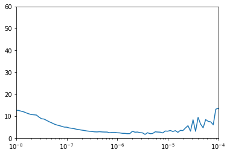
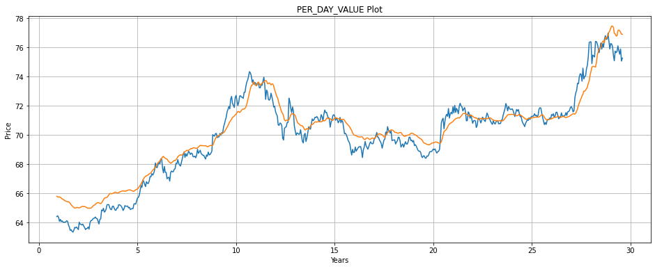
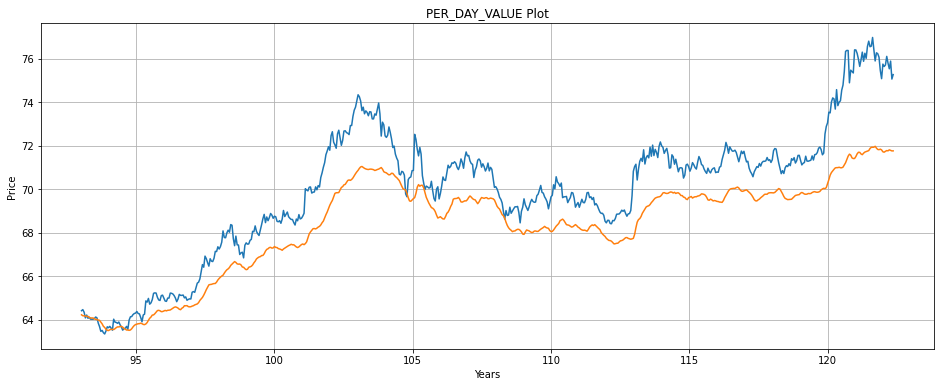
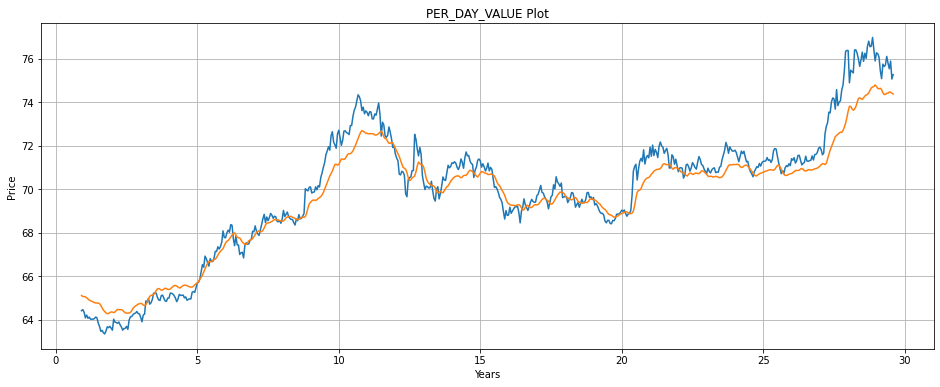
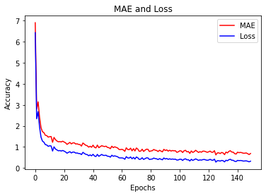

#  INR-USD Timeseries Analysis
A time-series analysis for predicting INR value agains USD currency per date, using last 10 years Dataset with Neural Networks

### Steps Performed 
- Fetch Dataset
- Feature Extraction
- Data Analysis
- Preprocessing
- Building Model
- Training Model
- Result Analysis
- Hypertuning
- Saving Model

### Model Build

Model: sequential
Layer (type)                 Output Shape              Param #   
conv1d (Conv1D)              (None, None, 60)          360       
lstm (LSTM)                  (None, None, 60)          29040     
lstm_1 (LSTM)                (None, None, 60)          29040     
dense (Dense)                (None, None, 30)          1830      
dense_1 (Dense)              (None, None, 10)          310       
dense_2 (Dense)              (None, None, 1)           11        
lambda (Lambda)              (None, None, 1)           0         
Total params: 60,591
Trainable params: 60,591
Non-trainable params: 0
_________________________________________________________________

### Result
Choosing Learning Rate

  </img>

Test 1

  </img>

Test 2 - Hypertuned

  </img>

Test 3

  </img>

_____________
Accuracy Loss

  </img>
  </img>
  

### For detailed info, check the notebook.
